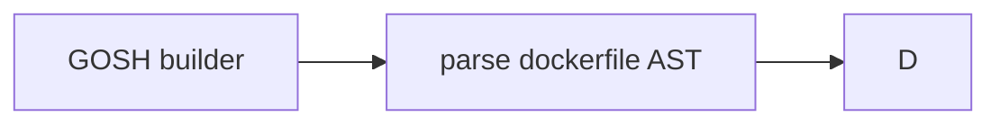
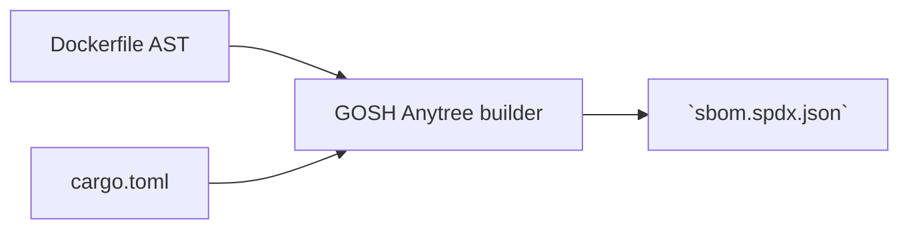

# Architecture <!-- omit in toc -->

- [SBOM](#sbom)
- [GOSH Anytree prepare SBOM](#gosh-anytree-prepare-sbom)
- [build phase (gosh build)](#build-phase-gosh-build)
- [Prepare dependencies from sbom for cargo](#prepare-dependencies-from-sbom-for-cargo)



gosh build -> docker builder -> (dockerfile) #syntax=gosh-image-builder -> json(OCI)
                -> HASH
dev:  null -> sbom
prod: sbom -> new.sbom == old.sbom

## SBOM

sbom.spdx.json -> works as a lock file

## GOSH Anytree prepare SBOM



1. parse Dockerfile AST (see below)
   1. add sbom images
2. prepare and parse Cargo.lock (for now: it's on developer)
   1. add sbom cargo deps

?? this format is under research

```code
----------------------------------
sbom.spdx.json        | cache (db)
----------------------------------
- root                | hash
  - 1st lvl dep       | hash
    - 2nd lvl dep
  - 1st lvl dep
  - 1st lvl dep
```

## build phase (gosh build)


```bash
gosh build --collapsed-sbom {gosh-url}

# dockerfile -> sbom -> leaf from gosh(check sbom exists)
#     - dockerfile -> sbom
```

1. clone repo from gosh

    ```bash
    $ ls -la
    - Gosh.yaml
    - Dockerfile
    - sbom.spdx.json
    ```

2. Using `sbom.spdx.json` + `gosh.yaml` start build

    ```yaml
    dockerfile:
        path: Dockerfile
    tag: gosh-builder-result
    prepare:
        - cargo
    ```

3. parse dockerfile (use Go implementation from Moby)
   1. get arbitrary representation of AST
   2. for each image:
      1. build image recursivly + localy remember @sha:923847298374 of image
   3. AST llb replace image name -> image_name@sha:3940823 from 3.2.1
   4. compare stable hash for each image with sbom stable image hash

         ```bash
         for each image: stable_image_hash(image) in sbom
         ```

   5. ?(TODO: research): in the end: json representation llb for docker builder

4. (if cargo) prepare dependencies from sbom (as if it's lock file) [prepare-dependencies-from-sbom](prepare-dependencies-from-sbom)
5. docker build (network none)
   1. mount dependencies
   2. normal docker build phase (low-level builder aka llb)

## Prepare dependencies from sbom for cargo

gosh build reads `sbom.json`
    - downloads all dependencies
      - cargo dependency
      - (not implemented yet -- will be plugins)

if cargo:
    - creates(or reservers) all mounts /root/.cargo/registy ... needs research
